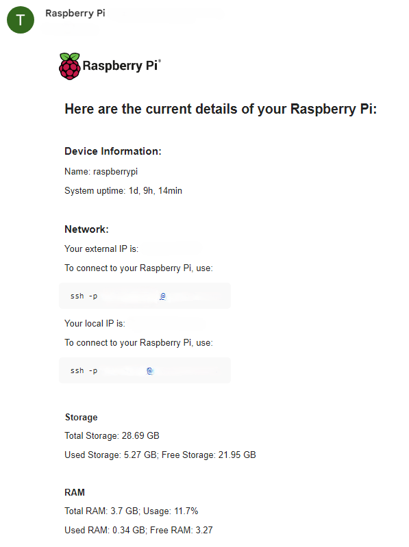

# Mail Service Raspberry Pi

Welcome to the Mail Service Raspberry Pi project! This README will guide you through setting up a small mail service primarily for your Raspberry Pi, allowing you to send daily emails with system information at a specified time.

## Overview

This project is designed to set up a mail service tailored for your Raspberry Pi, enabling you to receive daily emails containing essential system information. 
While the focus is on Raspberry Pi, you can also adapt it for use with Linux devices. 
Additionally, an [example.py](example.py) file is provided, allowing you to send system information emails without the service functionality.

<b>Currently, Windows service is not implemented and macOS is not supported!!!</b>

To see the example mails for every system, check [assets/example_mails](assets/example_mails):

Here the Raspberry Pi example:



## Table of Contents

- [Configuration](#configuration)
- [Installation](#installation)
- [Contributing](#contributing)

## Configuration

To configure the mail service, edit the [settings.conf](settings.conf) file. Here's a breakdown of each setting:

- `SEND_HOUR` and `SEND_MINUTE`: Specify the time when the email should be sent.
- `SENDER_MAIL`: Your email address used as the sender.
- `SENDER_PASSWORD`: Password for the sender email account (be cautious storing passwords).
- `RECEIVER_MAIL`: Email address of the recipient.
- `SMTP_SERVER_ADDRESS` and `SMTP_SERVER_PORT`: SMTP server details (for Gmail, default settings are provided).
- `DISK_PATH`: Path to the drive to monitor occupancy.
- `PI_EXTERNAL`: Set to `True` if using Raspberry Pi with external access, else set to `False`.
- `PI_EXTERNAL_PORT` and `PI_LOCAL_PORT`: Ports for external and local connections.
- `PI_USER`: Username for Raspberry Pi.

Example `settings.conf`:

```python
# settings.conf
SEND_HOUR = 12
SEND_MINUTE = 0

SENDER_MAIL = "your_email@example.com"
SENDER_PASSWORD = "your_mail_password"
RECEIVER_MAIL = "recipient@example.com"
SMTP_SERVER_ADDRESS = "smtp.example.com"
SMTP_SERVER_PORT = 465

DISK_PATH = "auto"

PI_EXTERNAL = True
PI_EXTERNAL_PORT = 12345
PI_LOCAL_PORT = 22
PI_USER = "your_pi_user"
````

## Setup
Before starting, ensure you have Python and pip installed. Run the following commands in your terminal:3

<b> Important: If you're using Python 3, change the commands from `python` to `python3`.</b>

````bash
python --version
pip --version
````

<br>
<b> Important:Execute the python commands as root user.</b>

Before executing setup.py to install the service, use example.py to test your settings or simply send a system information email. Navigate to the project directory and run:
````bash
sudo python example.py
````
If everything works correctly, you can proceed to install the service using setup.py:

````bash
sudo python setup.py
````
<br>
<b>Your Service is stored at `/etc/systemd/system/info-mail.service`</b>

To ensure that everything works correctly, you may need to restart the service. Run the following command:
````bash
systemctl restart info-mail.service
````
Check that the service is aktiv and running:
````bash
systemctl status info-mail.service
````
If you want the service to automatically start when your device restarts, enable it using the following command:
````bash
systemctl enable info-mail.service
````
To stop the service, use the following command:
````bash
systemctl stop info-mail.service
````
<br>

It's worth noting that changes made to the [settings.conf](settings.conf) file require a restart of the service.

## Contributing
Your contributions mean a lot! As I work on developing this project further, I'm enthusiastic about learning and welcome any feedback. Your insights and suggestions are valued!

Feel free to contribute to the project and help elevate it to new heights. Your support is immensely appreciated!
